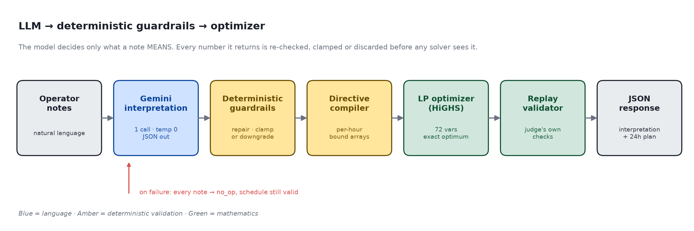
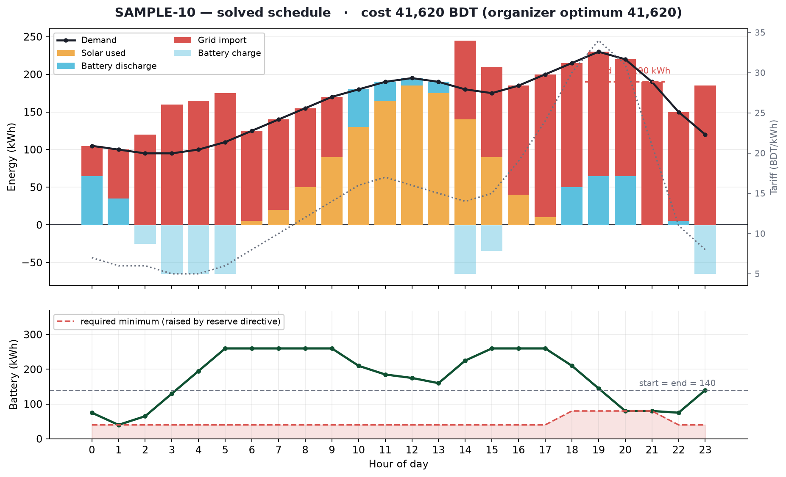

<div align="center">

# GridWise LLM

### Smart Campus Energy Optimization · LLM-Assisted Operator Directive Interpretation

**BUP CSE Fest 2026 — Online Preliminary**

*A campus operator writes a note in plain English. A language model reads it.
Deterministic code checks every number the model produced. A linear program then
builds the cheapest 24-hour schedule that provably obeys it.*

`FastAPI` · `Google Gemini` · `SciPy HiGHS` · `Docker`

</div>

---

## Table of Contents

| | |
|---|---|
| [1. The Problem](#1-the-problem) | What the service receives and must return |
| [2. Architecture](#2-architecture) | LLM → guardrails → optimizer, and why it is split that way |
| [3. Why an LLM at All](#3-why-an-llm-at-all) | The exact job the model does, and the job it is never given |
| [4. Supported Directives](#4-supported-directives) | The six types and their machine-checkable shapes |
| [5. Deterministic Guardrails](#5-deterministic-guardrails) | How untrusted model output is made safe |
| [6. The Optimizer](#6-the-optimizer) | LP formulation, battery model, energy balance |
| [7. Replay Validation](#7-replay-validation) | Re-running the judge's own checks before responding |
| [8. Quickstart](#8-quickstart) | Clean-machine setup in four commands |
| [9. API Reference](#9-api-reference) | Endpoints with copy-paste `curl` examples |
| [10. Testing](#10-testing) | Offline suite and the local scoring harness |
| [11. Docker](#11-docker) | Build, run, and the published fallback image |
| [12. Configuration](#12-configuration) | Environment variables and secret handling |
| [13. Project Structure](#13-project-structure) | Eight files, and what each one owns |
| [14. Dependencies & Credits](#14-dependencies--credits) | |
| [15. Known Limitations](#15-known-limitations) | |

---

## 1. The Problem

The service receives a 24-hour campus energy scenario — hourly demand, rooftop solar
forecast, and grid tariff — together with **1–3 natural-language notes** written by a
campus operator. Some notes change how the day must be run. Others are ordinary campus
chatter and must be ignored.

> *"Facilities will wash the rooftop solar panels from noon until 2 PM. During cleaning,
> usable solar should be treated as roughly 25% of the forecast."*
>
> *"The sports office moved next month's registration deadline."*

The first note is a hard constraint on hours 12 and 13. The second is noise. The service
must return **both** a machine-checkable interpretation of every note **and** a 24-hour
battery/solar/grid schedule that satisfies the real ones while minimising grid cost.

The judge scores interpretation and application **separately**. A cheap schedule built on
a misread note scores zero on both.

---

## 2. Architecture



The pipeline has one organising principle:

> **The language model decides what a note *means*. It never decides what the schedule *is*.**

Each stage narrows what the next stage is allowed to believe:

| Stage | Owns | Trusts its input? |
|---|---|---|
| **Gemini interpretation** | Semantics: paraphrase, time windows, relative quantities | — |
| **Guardrails** (`directives.py`) | Type safety, ranges, shapes, note coverage | **No.** Model output is untrusted data |
| **Directive compiler** (`directives.py`) | Folding directives into per-hour bound arrays | Yes — input is already validated |
| **LP optimizer** (`optimizer.py`) | The mathematics, exclusively | Yes |
| **Replay validator** (`validate.py`) | Re-deriving every rule from the finished plan | **No.** Re-checks the optimizer's own work |

Note the two independent trust boundaries. The guardrails protect the optimizer from the
model; the replay validator protects the *response* from the optimizer. A bug in either
direction is caught before it reaches the judge.

### Request flow

```
POST /optimize-energy
   │
   ├─ pydantic validation ──────────────── malformed → 400, never a crash
   │
   ├─ Gemini: 1 call, all notes, temp 0 ── failure → every note becomes no_op
   │
   ├─ sanitize(): repair or downgrade ──── unknown type → no_op, never passed through
   │
   ├─ compile_scenario(): bound arrays ─── overlapping directives compose, tightest wins
   │
   ├─ LP solve (HiGHS) ─────────────────── infeasible → relax in tiers, always returns
   │
   ├─ replay(): the judge's checks ─────── violation → fall back to no-directive solve
   │
   └─ recompute totals → JSON response
```

---

## 3. Why an LLM at All

The challenge requires a language model on the `directive_interpretation` path, and the
requirement is a real one. These three notes carry the *same* directive:

| Wording | Interpretation |
|---|---|
| "PV production will drop to about 20% between 13:00 and 15:00." | `solar_reduction`, hours `[13,14]`, factor `0.2` |
| "Panel washing from one until three will leave roughly one-fifth of normal output." | *identical* |
| "Expect an 80% reduction in rooftop solar during the 1-3 PM maintenance window." | *identical* |

Pattern matching cannot span "one-fifth", "drop to about 20%", and "an 80% reduction"
landing on the same number — the last one is stated as the *inverse*. Nor can it resolve
*"keep at least 50% of battery capacity"* into `100 kWh` without knowing the battery is
200 kWh. That is semantic work, and it is what the model is for.

What the model is **never** asked to do is produce a schedule, a cost, or any number that
was not derived from a note. It emits structured directives; everything downstream is
deterministic and reproducible.

---

## 4. Supported Directives

Six types. Anything else is rejected by the guardrails before it can reach the optimizer.

| Type | Meaning | `structured_adjustment` | Constraint applied |
|---|---|---|---|
| `solar_reduction` | Usable solar is reduced | `{"hours":[…], "factor": n}` | `effective_solar[h] = solar[h] × factor` |
| `minimum_battery_reserve` | Battery floor is raised | `{"hours":[…], "minimum_energy_kwh": n}` | `soc[h] ≥ max(base, directive)` |
| `no_charge_window` | Battery cannot charge | `{"hours":[…]}` | `flow_hi[h] = 0` |
| `no_discharge_window` | Battery cannot discharge | `{"hours":[…]}` | `flow_lo[h] = 0` |
| `max_grid_window` | Grid import is capped | `{"hours":[…], "max_grid_kwh": n}` | `grid[h] ≤ cap` |
| `no_op` | Note is irrelevant | `null` | none |

**Time convention.** Whole hours, start included, **end excluded**. `1 PM to 3 PM → [13,14]`.
`6 PM until 10 PM → [18,19,20,21]`.

**Factor convention.** `factor` is the fraction that **remains**, never the amount lost.
An *80% reduction* is `factor = 0.2`.

**`applies` semantics.** `true` for all five real directives. `false` **only** for `no_op`,
which must also carry `structured_adjustment: null`.

---

## 5. Deterministic Guardrails

Model output is treated as hostile input. Every field is re-derived, and the module
**never raises** — a bad interpretation degrades to `no_op`, it does not become a 500.

| Situation | Response |
|---|---|
| Unknown `directive_type` | Downgraded to `no_op` |
| Hours `[25, 3, 3, "x", true, -2]` | Repaired to `[3]` — deduped, sorted, out-of-range dropped |
| Hours as `{"start":14,"end":16}` | Expanded to `[14,15]`, end excluded |
| Quoted numbers: `"hours":["18","19"]` | Coerced to integers |
| `factor: 20` (a percentage) | Normalised to `0.2` — **not** clamped to `1.0`, which would silently delete the directive |
| `factor: 1.8` | Clamped to `1.0` |
| `minimum_energy_kwh` above capacity | Clamped to capacity |
| Negative `max_grid_kwh` | Clamped to `0` |
| Extra keys (`"confidence": 0.9`) | Stripped — `structured_adjustment` shape is scored |
| Duplicate or missing `note_index` | Re-assigned by position; no note is ever dropped |
| `applies` inconsistent with type | Forced consistent |
| Model returns `null`, `[]`, or garbage | Exactly one `no_op` per note, in order |

Overlapping directives of the same type **compose** rather than override: minimum factor,
maximum reserve, minimum grid cap, union of window hours.

---

## 6. The Optimizer

The objective is linear, every constraint is linear, and the battery is lossless
(`E_after = E_before ± battery_kwh`). The problem is therefore a **linear program**, and
the LP optimum *is* the optimum — no heuristic, no search, no tuning.

Solved with **SciPy's HiGHS** backend in roughly 5 ms.

### Decision variables — 72 total

For each hour `h ∈ [0, 23]`:

| Variable | Bounds |
|---|---|
| `grid[h]` | `[0, grid_hi[h]]` — `∞` unless a `max_grid_window` applies |
| `solar[h]` | `[0, effective_solar[h]]` — unused solar is curtailed |
| `flow[h]` | `[-max_discharge, +max_charge]` — **signed**: positive charges, negative discharges |

> **Why one signed flow variable rather than separate charge/discharge variables:**
> it makes simultaneous charging and discharging *structurally impossible* rather than a
> degenerate solution to be cleaned up afterwards, and `no_charge` / `no_discharge` windows
> become a single bound assignment. Fewer variables, fewer failure modes.

### Objective

```
minimize   Σ  grid[h] × tariff[h]
          h=0..23
```

### Constraints

```
Energy balance      grid[h] + solar[h] − flow[h] = demand[h]          ∀h      (24 equalities)
Day neutrality      Σ flow[h] = 0                                              (1 equality)
State of charge     min_soc[h] ≤ E₀ + Σ flow[k] ≤ capacity           k ≤ h    (48 inequalities)
```

Energy balance reads naturally: charging *consumes* energy, discharging *supplies* it, so a
signed flow enters with a single sign. Day neutrality enforces the rule that the battery
may shift energy between hours but cannot be drained as a free one-time source.

Every directive from §4 lands on exactly one of these lines — there is no separate
"directive handling" code path to get out of sync.

### Infeasibility

Organizer scenarios are guaranteed feasible, so an infeasible model means the *model*
misread something. Rather than fail, the solver relaxes in tiers — drop grid caps, then
reserves, then all directives — and returns the first feasible solution. A valid schedule
always comes back.

### A solved case



SAMPLE-10, with a reserve directive and a grid cap both active in the evening. The battery
charges through the cheap early-morning tariff and the midday solar surplus, then carries
the expensive evening peak while staying above the raised reserve floor (shaded) and under
the 190 kWh grid cap. It ends the day exactly where it started.

---

## 7. Replay Validation

Before any response leaves the service, the finished plan is re-checked against the same
rules the judge applies — deliberately **without** reusing the optimizer's state, so a bug
cannot hide behind a shared intermediate value.

Checked at `0.01` absolute tolerance: 24 unique hours · finite non-negative values ·
`solar_used ≤ effective_solar` · hourly energy balance · battery transitions, capacity,
reserve floor and rate limits · `battery_kwh = 0` when idle · every directive window and
grid cap · end-of-day neutrality · summary fields recomputed from `hourly_plan`.

Crucially, replay checks the plan against the directives the response **reports**, not
against whatever subset the solver managed to satisfy. An earlier version validated the
post-relaxation scenario, so a plan shipping 175 kWh against a reported 1 kWh cap passed
with zero errors — the exact "extracted but not applied" failure the rubric zero-scores.
When directives are mutually unsatisfiable the service returns the best feasible schedule
and says so in `plan_summary` rather than silently claiming a constraint it broke.

---

## 8. Quickstart

Clean machine, Python 3.12+. No steps beyond these.

```bash
git clone https://github.com/Azm1ne/gridwise-llm.git
cd gridwise-llm

python3 -m venv .venv && source .venv/bin/activate
pip install -r requirements.txt

cp .env.example .env        # then open .env and paste your Gemini API key
uvicorn app.main:app --host 0.0.0.0 --port 8000
```

Verify:

```bash
curl -s localhost:8000/health
# {"status":"ok"}
```

> A free Gemini API key is available at <https://aistudio.google.com/apikey>.
> Without a key the service still starts and still returns valid, optimal schedules —
> every note is simply interpreted as `no_op`.

---

## 9. API Reference

### `GET /health`

Readiness probe. Performs no I/O and makes no model call, so it answers immediately on a
cold start.

```bash
curl -s http://localhost:8000/health
```
```json
{"status": "ok"}
```

### `POST /optimize-energy`

```bash
curl -s -X POST http://localhost:8000/optimize-energy \
  -H 'Content-Type: application/json' \
  -d '{
    "scenario_id": "GRID-101",
    "operator_notes": [
      "Solar output will drop to about 20% from 1 PM to 3 PM.",
      "Do not charge the battery between 2 PM and 4 PM.",
      "The cafeteria menu changes tomorrow."
    ],
    "hours": [
      {"hour":0,"demand_kwh":180,"solar_kwh":0,"tariff_bdt_per_kwh":7},
      {"hour":1,"demand_kwh":170,"solar_kwh":0,"tariff_bdt_per_kwh":6}
      /* … 22 more entries, one per hour 0–23 … */
    ],
    "battery": {
      "capacity_kwh": 500, "initial_energy_kwh": 200, "minimum_energy_kwh": 50,
      "max_charge_kwh_per_hour": 100, "max_discharge_kwh_per_hour": 100
    }
  }'
```

A complete, runnable request body is in
[`BUP_CSE_FEST_2026_Preli_Public_Sample_Cases.json`](BUP_CSE_FEST_2026_Preli_Public_Sample_Cases.json)
under any case's `input` key.

**Response**

```json
{
  "scenario_id": "GRID-101",
  "directive_interpretation": [
    {"note_index": 0, "applies": true, "directive_type": "solar_reduction",
     "structured_adjustment": {"hours": [13, 14], "factor": 0.2},
     "explanation": "Usable solar is reduced to 20% for hours 13-14."},
    {"note_index": 1, "applies": true, "directive_type": "no_charge_window",
     "structured_adjustment": {"hours": [14, 15]},
     "explanation": "Battery charging is unavailable for hours 14-15."},
    {"note_index": 2, "applies": false, "directive_type": "no_op",
     "structured_adjustment": null,
     "explanation": "This note does not affect today's energy schedule."}
  ],
  "hourly_plan": [
    {"hour": 0, "grid_kwh": 180.0, "solar_used_kwh": 0.0,
     "battery_action": "idle", "battery_kwh": 0.0, "battery_energy_after_kwh": 200.0}
  ],
  "total_grid_kwh": 2692.5,
  "total_cost_bdt": 38365.0,
  "peak_grid_kwh": 175.0,
  "plan_summary": "Applied 2 operator directive(s): solar_reduction, no_charge_window. …"
}
```

### Status codes

| Code | When |
|---|---|
| `200` | Successful optimization |
| `400` | Malformed JSON or structurally invalid request |
| `500` | Controlled internal error — no stack trace, no secrets in the body |

---

## 10. Testing

### Offline suite — no API key required

```bash
pytest -q
```

Covers the optimizer against all ten public cases, the replay validator (including a
negative control that corrupts a valid plan and asserts the validator catches it), and the
guardrails against hostile model output.

**Current result — 51 passed.** On every public case the LP reproduces the organizer's
reference cost exactly:

| Case | Our cost (BDT) | Reference | Ratio |
|---|---|---|---|
| SAMPLE-01 | 38,365 | 38,365 | 1.0000 |
| SAMPLE-02 | 42,885 | 42,885 | 1.0000 |
| SAMPLE-03 | 35,480 | 35,480 | 1.0000 |
| SAMPLE-04 | 40,495 | 40,495 | 1.0000 |
| SAMPLE-05 | 33,950 | 33,950 | 1.0000 |
| SAMPLE-06 | 34,090 | 34,090 | 1.0000 |
| SAMPLE-07 | 38,550 | 38,550 | 1.0000 |
| SAMPLE-08 | 37,665 | 37,665 | 1.0000 |
| SAMPLE-09 | 34,873 | 34,873 | 1.0000 |
| SAMPLE-10 | 41,620 | 41,620 | 1.0000 |

### Local scoring harness — requires an API key

```bash
python scripts/score.py           # full pipeline, scored the way the rubric scores it
python scripts/score.py --probe   # list the models your key can use
```

Runs every public case end to end and reports per-sub-criterion interpretation accuracy,
schedule validity, cost ratio and p95 latency.

### Regenerating the diagrams

```bash
pip install -r requirements-dev.txt
python scripts/make_diagrams.py
```

Both figures are produced from the live solver, not drawn by hand.

---

## 11. Docker

```bash
docker build -t gridwise-llm:v1 .

docker run --rm -p 8000:8000 -e GEMINI_API_KEY=your_key_here gridwise-llm:v1

curl -s localhost:8000/health     # {"status":"ok"}
```

The image runs as a non-root user, binds `0.0.0.0`, honours `$PORT` (so it drops straight
into Render, Fly or Cloud Run), and contains **no baked-in credentials** — the key is
supplied at run time. `.env` is excluded via `.dockerignore`.

---

## 12. Configuration

| Variable | Required | Default | Purpose |
|---|---|---|---|
| `GEMINI_API_KEY` | yes | — | Google Gemini credential. `LLM_API_KEY`, `GOOGLE_API_KEY` and `GOOGLE_GENAI_API_KEY` are accepted as aliases. |
| `LLM_MODEL` | no | `gemini-3.5-flash-lite` | Model used for interpretation |
| `LLM_TIMEOUT_S` | no | `12` | Per-call timeout; one retry on transport failure |
| `PORT` | no | `8000` | Listen port (set automatically by most hosts) |

**Model / provider:** Google Gemini via the `generativelanguage.googleapis.com`
`generateContent` REST endpoint, called with `temperature: 0` and
`responseMimeType: application/json`.

### Secret handling

- Secrets live only in `.env` (git-ignored) or the host's environment settings.
- `.env.example` is a template with **empty** values and is the only env file in git.
- `.env` is excluded from the Docker build context, so no key can be baked into an image.
- The `500` handler logs the exception type internally and returns `{"error":"internal error"}` —
  no stack traces, no configuration, no credentials on the wire.
- Request logs record scenario id, note count and stage latencies. Never the key, never the prompt.

---

## 13. Project Structure

Eight source files. Each owns one stage of the pipeline; none exists to satisfy a pattern.

```
app/
├── main.py         FastAPI app, request wiring, error handlers
├── models.py       pydantic request/response schemas — the API contract
├── llm.py          Gemini client, prompt, safe degradation
├── directives.py   guardrails (sanitize) + compiler (compile_scenario)
├── optimizer.py    LP construction, solve, plan assembly, plan_summary
└── validate.py     independent replay of the judge's checks

scripts/
├── score.py          local scoring harness
└── make_diagrams.py  README figures, generated from the live solver

tests/test_offline.py  37 tests, no API key required
Dockerfile · .dockerignore · requirements.txt · requirements-dev.txt
```

---

## 14. Dependencies & Credits

| Package | Role |
|---|---|
| [FastAPI](https://fastapi.tiangolo.com/) | HTTP framework |
| [Uvicorn](https://www.uvicorn.org/) | ASGI server |
| [Pydantic](https://docs.pydantic.dev/) v2 | Schema validation — the `400` path |
| [SciPy](https://scipy.org/) | `optimize.linprog`, HiGHS backend |
| [NumPy](https://numpy.org/) | LP matrix construction |
| [httpx](https://www.python-httpx.org/) | Async HTTP client for Gemini |
| [pytest](https://docs.pytest.org/) | Test runner *(dev only)* |
| [Matplotlib](https://matplotlib.org/) | README figures *(dev only, excluded from the image)* |
| [Google Gemini API](https://ai.google.dev/) | Operator-note interpretation |

Architecture, LP formulation, guardrail design and prompt are the team's own work.
AI coding assistance was used during implementation, as permitted by the rulebook.

---

## 15. Known Limitations

- **Model availability is an external dependency.** If Gemini is unreachable or rate-limited,
  every note degrades to `no_op`. The schedule stays valid and cost-optimal for the
  unconstrained problem, but directive credit for that request is lost. Mitigated with a
  12-second timeout, one retry, and a single call per request.
- **Interpretation is bounded by the six published directive types.** A hidden note
  expressing something outside them resolves to `no_op` by design, rather than being
  forced into an ill-fitting type.
- **Relaxation is silent to the client.** When directives are contradictory the solver
  relaxes in tiers and logs the tier; the response does not advertise it. Returning a valid
  schedule was judged more useful than returning an error.
- **No response caching.** Every request re-queries the model. At the hidden-test volume
  this costs latency but keeps behaviour stateless and reproducible.
- **Ambiguous relative reserves.** *"Keep 50% in reserve"* is read against battery
  capacity. If a hidden case means 50% of the *current* charge, that reading would differ.
- **Free-tier provider quota is the binding constraint.** Paced requests score 10/10
  interpretation at a p95 of 1.8s. Under 34 back-to-back requests the free tier throttles,
  some notes degrade to `no_op`, and p95 rises past 5s. The service stays correct and
  returns valid schedules throughout; the loss is interpretation credit, not validity.
- **Relaxation is per directive type.** One unsatisfiable grid cap discards other grid
  caps that were individually satisfiable. Organizer scenarios are guaranteed feasible,
  so this path should not fire during judging.

---

<div align="center">

**BUP CSE Fest 2026** · Department of CSE, Bangladesh University of Professionals

</div>
